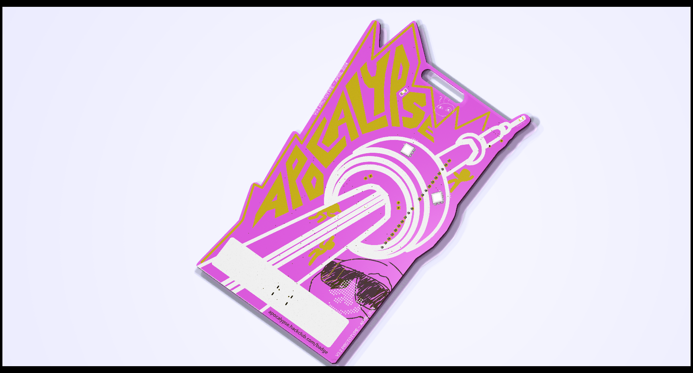
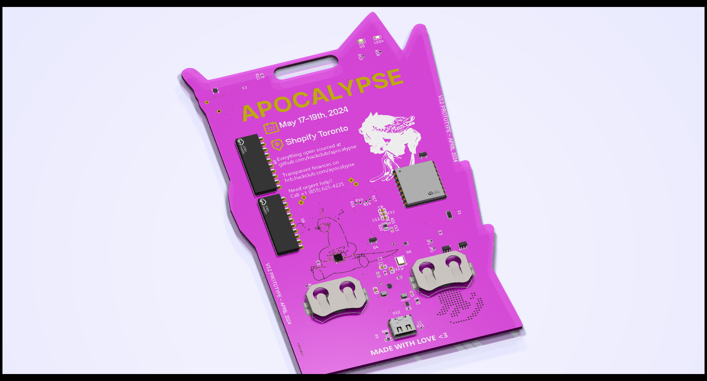

[Apocalypse's](https://apocalypse.hackclub.com/) official name tag badge PCB for every participant to wear during the event. Designed in KiCad with help from other hack clubbers, it has a handful of LEDs powered by dual LIR2032 batteries. For sourcing power to the batteries, the board has a wireless charging and NFC Capabilities as well a USB-C port for flashing and charging.

## Full-Design PCB

|Apocalypse PCB Front|Apocalypse PCB Back|
|:-:|:-:|
| "Apocalypse PCB Front")|  "Apocalypse PCB Back"

## Simple-Design PCB

|Apocalypse PCB Front|Apocalypse PCB Back|
|:-:|:-:|
| "Apocalypse PCB Front")|  "Apocalypse PCB Back"

## [PCBWay](https://www.pcbway.com/)
PCBWay has been enormously helpful with getting my design manufactured, with their supportive engineers highlighting working with my design adding suggestions, and their extensive catalogue of parts available for assembly, it's been a pleasure working with them. PCBWay gave us the opportunity to supply hackers (high-schoolers) with 200 NameTag badges at the hackathon in May. Soldering classes were run and people had a blast seeing my design choices and learning how the PCB worked and was put together.
